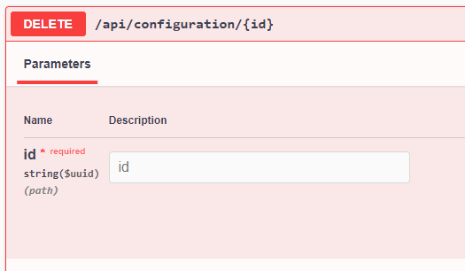

# Currency Quote
Aplicação destinada a conversão de moedas estrangeiras para real que permite a parametrização de taxas customizadas por seguimento de cliente. 

A aplicação foi desenvolvida em **.net 5** utilizando **Clean Architecture** com o intúito de separar as responsabilidades em Presentation -> Domain -> Data.

Foram utilizados algumas bibliotecas que facilitam o desenvolvimento tanto da aplicação em si quanto dos testes integrados, são elas:

**Dapper** - ORM utilizado no projeto **Br.Com.Company.CurrencyQuote.IT** efetuar a consulta aos dados inseridos pelos casos de teste implementados.

**AutoMapper** - Biblioteca para conversão de objetos, utilizada no projeto **Br.Com.Company.CurrencyQuote.Domain** para converter os DTOs recebidos nos controllers para os Commands utilizados no Domain.

**Polly** - Biblioteca responsável pela resiliencia na execução das migrations do banco de dados na inicialização da aplicação e na resiliencia do acesso a API externa de taxa de cotações.

**MediatR** - Biblioteca utilizada para a implementação do padrão CQRS utilizado no projeto **Br.Com.Company.CurrencyQuote.Domain**.

**Flurl** - Biblioteca para facilitar a elaboração de requisições HTTP no projeto 
**Br.Com.Company.CurrencyQuote.Domain** para a consulta a API ExchangeRatesApi.

**Swagger** - Biblioteca que facilita a utilização da API, disponibilizando uma interface gráfica para utilização dos endpoints.

**FluentValidation** - Biblioteca que possibilita efetuar de forma bem simples a validação dos dados informados pelo cliente nas requisições efetuadas aos endpoints da API. Utilizado no projeto **Br.Com.Company.CurrencyQuote.Domain**

**FluentAssertions** - Biblioteca que simplifica e da mais opções de validações aos dados testados no projeto de teste integrado **Br.Com.Company.CurrencyQuote.IT**.

**WireMock** - Biblioteca responsável por fazer o mock da APIs externas, utilizada no projeto **Br.Com.Company.CurrencyQuote.IT** facilitando os testes integrados dos cenários de conversão de moéda.

**Specflow** - Biblioteca que permite a criação de testes integrados utilizando Guerkins escritos em liguagem ubíqua.

**Fluent Docker** - Biblioteca utilizada para facilitar a inicialização do ambiente de testes no docker. Utilizada no projeto de testes integrados, automatizano a execução do docker compose.

#### Funcionamento
A aplicação disponibiliza alguns endpoints para cadastro, atualização ou exclusão da taxa de conversão por segmento de cliente.
Também disponibiliza um endpoint para efetuar a conversão da moéda estrangeira para o Real.

##### Cadastro - (GET /api/configuration)
No endpoint de cadastro de taxa, é necessário apenas informar o **percentual** que será cobrado na conversão e o **segmento** de clientes (*Varejo, Personnalite e Private*)

##### Atualização (PUT /api/configuration)
No endpoint de atualização de configuração de taxa, é necessário apenas informar o Id interno do registro e a nova taxa a ser utilizada no segmento.

##### Exclusão (DELETE /api/configuration/{id})
No endpoint de exclusão de configuração de taxa, é necessário apenas informar o Id interno do registro a ser excluido.

##### Consulta por Segmento (GET /api/configuration/search)
No endpoint de consulta de configuração de taxa por segmento, é necessário apenas informar o **segmento** de clientes a ser consultado.

##### Consulta de Taxa Por Segmento (GET /api/configuration/searchRate)
No endpoint de consulta de taxa cobrada por segmento, é necessário informar o **Id** do registro ou **Segmento** de clientes a ser consultado.

##### Conversão (GET /api/quotation)
No endpoint de conversão de moéda, é necessário informar a **quantidade de moeda** estrangeira, o **tipo** da moeda estrangeira e o **segmento** de clientes a ser utilizado na conversão.

#### Bibliotecas utilizados:
- Dapper
- AutoMapper
- Polly
- MediatR
- Flurl
- Swagger
- FluentValidation 
- FluentAssertions (Testes)
- WireMock (Testes/Mock API)
- Specflow (Testes)
- Fluent Docker (Testes)

#### Padrões de projeto
 - Repository
 - CQRS
 - Notification

#### Banco de dados
- Postgresql v9.6 
